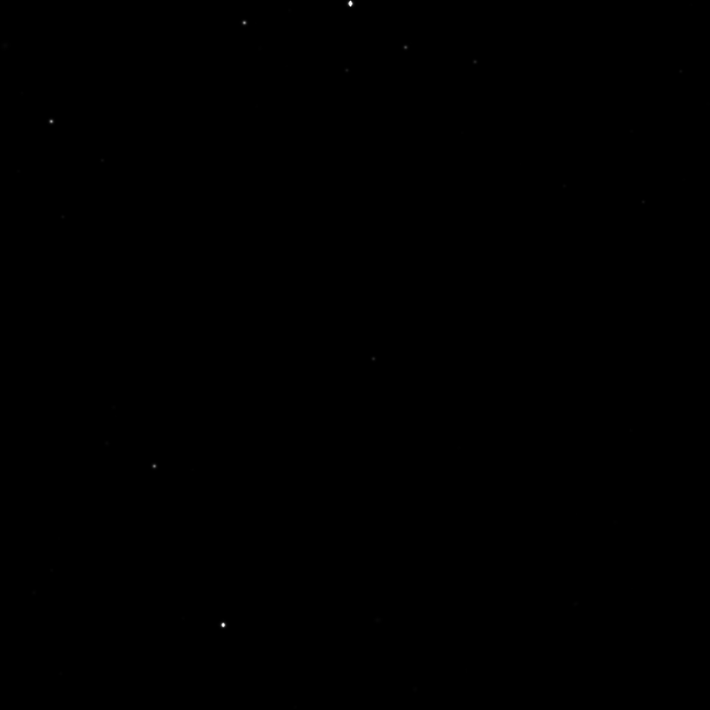
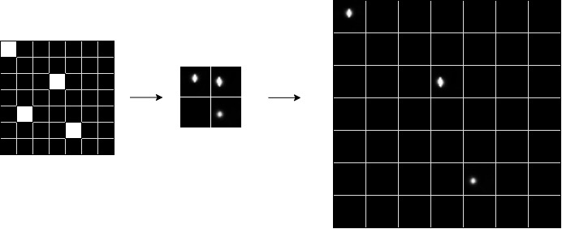

<h1 align="center">
  2-Stage GAN for Sparse Galaxy Image Generation
</h1>

Siméone de Fremond, Carlos Gomes, Andra-Maria Ilies, Andrej Ivanov 
                    Please refer to the <a href="report.pdf">project report</a> for details.  
 
The rapid growth of astronomical data in recent years has prompted interest in building generative models of cosmological images. This paper focuses on 2 related tasks in this area: 1) generating realistic images and 2) scoring how realistic an image is. We begin by formalizing  the  structure  of  the  images  in  terms  of  galaxies and their properties, and show that simplistic baselines are not sufficient for both tasks. We then present a novel generative approach consisting of a two-stage sampling generative adversarial neural network (GAN), capturing the position of cosmological objects and their representation separately, which produces diverse and realistic looking images. Furthermore, we develop an accurate scoring method based on Power Spectrum features. Using this scoring method we empirically show that our two-stage generative model significantly outperforms both the baselines and a standard GAN approach. Finally, we provide experiments towards understanding of the most important factors in our model.

## Dataset
On a high level, the images in our dataset are of a high resolution (1000x1000 pixels), but most of the image represents a constant dark background populated with a number of very distant, and hence tiny, celestial objects.

Below is a sample of what they look like: 

We consider any non-black cluster of pixels a galaxy. These objects in our images represent both stars and galaxies, but because of the low resolution we model them together, and for the rest of the paper we will refer to them as simply galaxies.
Visually, a galaxy is defined by 4 main properties: location in the image, size, intensity and shape.

## Scoring Model
To score the images and overcome the sparsity element we use an XGBoost model on a histogram of intensities of the picture as well as features from the 1D power spectrum of the image. (more details in the report)

## Generation Model
We use a 2-stage GAN that works in the following way:
- Position sampling: For each image in our dataset, we divide it into a 32x32 grid. Cells in this grid with galaxies are marked with a 1, and those without are marked with a 0. The first GAN, which we will refer to as the position GAN, learns these as 32x32 images, and is able to output such a grid representing the locations of galaxies in the image
- Galaxy sampling: we use a second GAN, which we will call the galaxy GAN, to generate images of individual galaxies conditioned on the size of the galaxy. The training data is made up of extracted 32x32 galaxy patches from our original dataset. 

Essentially, the  position  GAN  generates  a  grid,  and  the  galaxyGAN produces the necessary galaxies. A generated galaxy isplaced wherever a cell is 1, and 0s wherever it is 0.
 

## Setup

Place the 3 image folders *labeled*, *query* and *scored* in the data directory.

Run `python setup.py develop`.

Run `conda env create -f environment.yml`, followed by `conda activate galaxy_gen`.

In order to train the two-stage models, under the scripts directory, run `python galaxy_patches.py`.

## Project directories
1. *generators*: contains the generative model classes for all our generative models
2. *regressors*: contains the regressor model classes for all our regression models
3. *training*: contains the notebooks and scripts used to train our generative/regressive models
4. *common*: common utils used throughout the project
5. *analysis*: experiments on our models and data analysis
6. *scripts*: self-explanatory

Each directory has its own README explaining how to run its scripts/notebooks.
